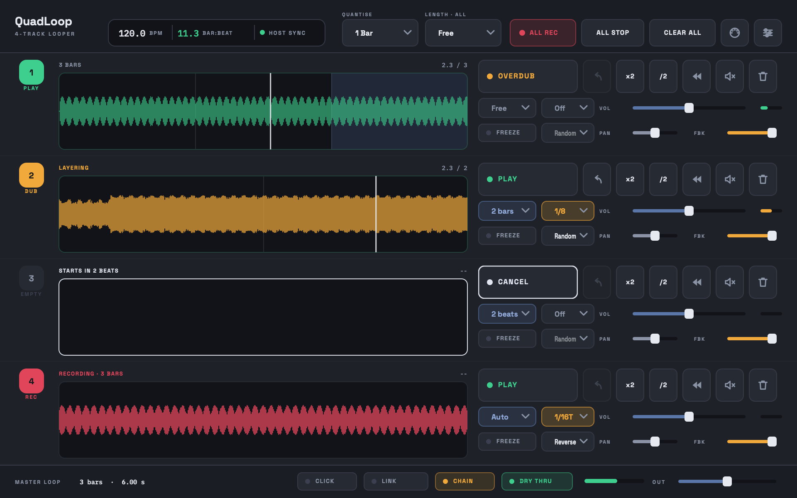

<div align="center">

# QuadLoop

**Four loop slots that launch on the bar, in any DAW.**

VST3 · Audio Unit · CLAP · Standalone — macOS, universal

### [⬇&nbsp; Download the beta](../../releases) &nbsp;·&nbsp; [Report a bug](../../issues)

</div>



---

Built because Bitwig ships no looper, and because the loopers built into other
hosts tend to give you one track and a fixed length.

One stereo input, four independent slots. No routing to set up and no sidechain to
wire — it behaves the same in every host, the way a hardware looper does.

## What it does

| | |
| --- | --- |
| **Launch on the grid** | Loops open and close on the bar, quantised to the division you pick, so tracks stay locked to each other and to the project. The clock free-runs when the transport stops. |
| **Freeze** | Holds a short window of a loop and drones on it, so a chord sustains instead of going round. Two crossfaded read heads rather than a very short loop, which is what stops it clicking seven times a second. |
| **Multiply and divide** | Double a loop's length while it plays, copying what is already there so the base keeps sounding under a longer overdub. Halve it to get back. |
| **Reverse, down to the bar** | Flip a whole track, or one bar inside a running loop. Reverse is a mirrored index rather than a direction of travel, so a reversed track stays in phase with the other three. |
| **Glitch** | Slice a loop and let it stutter, repeat, play backwards in place, or gate — per track, on the beat division you choose. |
| **Undo** | On every track, and a safety limiter on the standalone. |

## Timing

A launch fires on the sample it was scheduled for, not on the next buffer boundary.

```
120 bpm, 48 kHz      one bar = 96,000 samples
buffer                          512 samples
                     96000 / 512 = 187.5
```

A bar does not divide evenly into a buffer, which is exactly why this matters. Firing
on block boundaries instead would land launches up to **10.6 ms late at a 512-sample
buffer, and inconsistently late** — which is what makes loops drift audibly against
the grid over the course of a set.

## Installing

Download the `.pkg` from [the latest release](../../releases) and double-click it.

It is **signed and notarised by Apple**, so it opens with no security warnings and
nothing to do in Terminal. It installs the VST3, Audio Unit, CLAP and the standalone
app, and asks for your password once because plug-ins live in a shared folder.

**Restart your music software afterwards** so it rescans. Logic and GarageBand in
particular only look once per launch.

### Which format

| Format | Hosts |
| --- | --- |
| **CLAP** | Bitwig Studio, Reaper — the best of the three in Bitwig |
| **VST3** | Ableton Live, Studio One, Cubase, Reaper |
| **Audio Unit** | Logic Pro, GarageBand, MainStage |
| **Standalone** | No host at all |

## About the beta

Releases marked **pre-release** are betas, and they stop **recording** after a date
shown under the wordmark in the plug-in. Playback keeps working past that date, so an
expired beta will not go silent in the middle of a session — it just will not record
anything new. Grab a newer build when that happens.

Projects made with a beta open in the release: the plug-in identity and the
saved-state format do not change between them.

Windows builds are in progress. The engine and its tests already run on Windows in
CI; what is missing is the installer.

## Reporting something

[Open an issue](../../issues) and include:

- **the build**, shown under the QuadLoop wordmark in the top left
- **your host** and its version, and whether you loaded the VST3, AU or CLAP
- **sample rate and buffer size**
- what you did, and what happened instead

Timing and sync problems are worth reporting even if they sound minor. Sample accuracy
is the thing this plug-in is built around, so "it drifted slightly" is a real bug
rather than a nitpick.

<div align="center">
<br>
<sub>QuadLoop is made by <b>FretZero</b>. This repository carries the builds; the source is not public.</sub>
</div>
